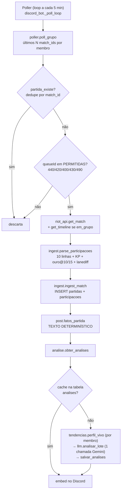

# discord-flex-analyst — como funciona

Leitura do código em 25/07/2026 (HEAD `5b9b8cd`). Documento descritivo: o que o
código faz hoje, não o que o briefing planeja. Onde os dois divergem, está marcado.

---

## 1. O que é, em uma frase

Um bot de Discord que descobre sozinho quando o grupo jogou LoL, baixa a partida da
Riot API, **calcula tudo em Python** (determinístico) e usa a LLM **só para narrar**
os números já calculados — postando automaticamente no canal.

A separação "código calcula / LLM narra" não é estilo: é a restrição de projeto que
explica quase toda decisão de arquitetura aqui.

---

## 2. A pipeline, ponta a ponta

O ponto que amarra tudo: **`post.fatos_partida()` produz um único texto que serve para
duas coisas ao mesmo tempo** — é o que o usuário lê no Discord *e* é o contexto que vai
no prompt da LLM. Isso é o que torna a regra "a LLM não calcula" verificável na prática:
ela literalmente não recebe nada além do texto que você também está lendo.

### Os dois gatilhos

| Gatilho | Entrada | Saída |
|---|---|---|
| **Automático** (poller, 5 min) | partidas novas de qualquer membro | jogo em grupo → 1 post do time; jogo solo → 1 post individual por membro presente |
| **Sob demanda** (slash commands) | `/time`, `/jogador`, `/perfil`, `/recordes` | lê do banco; se faltar timeline no cache, baixa na hora (`_garantir_cache_partida`) |

---

## 3. Modelo de dados

Cinco tabelas (`bot_lol/db/schema.sql`), divididas por uma regra explícita:

- **Entidades** (`grupos`, `jogadores`) — mutáveis, upsert. Nick muda, jogador sai.
- **Fatos** (`partidas`, `participacoes`) — só `INSERT`, nunca `UPDATE`. Uma partida é
  um evento histórico; reescrevê-la seria reescrever o passado.
- **Derivado/cache** (`analises`) — regravável (`salvar_analises` faz DELETE + INSERT).

Decisões que valem notar:

- **`participacoes` guarda os 10 jogadores**, não só os membros. `jogador_id = NULL`
  marca o não-membro. É o que permite calcular percentil-na-partida (você vs. os 10) e
  matchup contra o oponente direto da rota — nada disso seria possível guardando só o
  seu lado.
- **`em_grupo`** (2+ membros no mesmo time) é o eixo do produto inteiro: define quem
  conta para recordes, quem ganha timeline baixada e quem vira post de time vs. individual.
- **`challenges_json`** guarda cru as ~125 métricas pré-calculadas da Riot. Barato de
  guardar, e destrava conquistas novas depois sem re-ingerir nada.
- **Nada de percentil/ranking materializado.** Tudo se recalcula na hora. Custo disso
  está na seção 6.

---

## 4. Os módulos, e por que cada um existe

| Módulo | Papel | Nota |
|---|---|---|
| `config.py` | caminhos via `pathlib`, segredos via env/`.env` | zero caminho hardcoded — roda igual em Linux e Windows |
| `riot_api.py` | cliente HTTP: rate limit (95/2min, ~20/s), retry em 429/5xx, **cache em disco** | sem estado global; a chave é injetada |
| `ingest.py` | JSON da Riot → linhas do banco. **Lógica pura, sem rede** | por isso é testável de verdade (`test_ingest.py`) |
| `poller.py` | uma rodada de polling → lista de `partida_id` novos | **não fala com Discord nem sabe de asyncio** — recebe um `client` qualquer, o que permite testar com fake |
| `moments.py` | timeline → objetivos, swing de ouro, teamfights, multikills, pick-offs | honesto sobre confiabilidade: pick-off é declarado "melhor palpite" no próprio docstring |
| `records.py` | recordes do grupo + perfil individual, agregação pura | dois recortes (Flex sério / Normais zoeira) + Solo/Duo |
| `tendencias.py` | "perfil vivo": forma recente vs. antiga, evolução por campeão, matchups, padrões | tem **limiares de amostra mínima** explícitos (`MIN_JOGOS=20`, `MIN_MATCHUP=3`, `GAP_NOTAVEL=12pp`) |
| `post.py` | monta o texto determinístico (time e individual) | a fonte única que vira display **e** contexto da LLM |
| `llm.py` | única fronteira com o Gemini | trocar de provedor = mexer só aqui |
| `analise.py` | orquestra LLM + cache | 1 chamada por partida gera o lote inteiro |
| `discord_bot.py` | borda fina: comandos, autocompletes, poller | trabalho pesado sempre em `asyncio.to_thread` |

---

## 5. As três decisões mais inteligentes deste código

**1. Uma chamada de LLM por partida, não uma por jogador.**
`llm.analisar_lote` pede narrativa do time + análise de cada membro em um único JSON.
Com 5 membros, isso é 1 requisição em vez de 6. E o resultado inteiro vai para a tabela
`analises` — consultar `/time` e depois `/jogador` cinco vezes não custa nenhuma
chamada nova. Custo e latência ficam constantes por partida, não lineares no número de
gente que resolve olhar.

**2. Timeline só para jogos em grupo.**
A timeline é o objeto caro (minuto a minuto, os 10 jogadores). Baixar só quando
`em_grupo=True` corta a maior parte do tráfego do backfill. E há uma segunda camada:
quando alguém pede `/jogador` numa partida solo, `_garantir_cache_partida` busca a
timeline **sob demanda** — o dado caro só é pago quando alguém realmente quer olhar.

**3. Núcleo puro, bordas finas.**
`poller.poll_grupo` recebe uma conexão e um `client` e devolve uma lista de ints. Não
importa `discord`, não sabe de event loop. Por isso `test_poller.py` testa a lógica de
ingestão automática inteira com um cliente falso, sem rede e sem Discord. O mesmo vale
para `ingest`, `moments`, `records`, `tendencias`. Os 29 testes rodam em 0,26 s — o que
só é possível porque a parte que dói está separada da parte que fala com o mundo.

---

## 6. O que eu observaria antes de colocar em produção

Ordenado por quanto dói, não por quanto é difícil de arrumar. Marquei o grau de certeza.

### 6.1 O poller pode estrear cuspindo dezenas de posts (alta confiança)

`poll_grupo` devolve **todas** as partidas novas que encontrou, e `_poll_loop` posta
todas, uma por uma. Na primeira rodada após ligar o bot com o banco recém-populado — ou
depois de qualquer janela em que o bot ficou fora do ar — "novo" pode significar até
`5 × nº de membros` partidas. Com os 8 jogadores do `backfill.py`, são até 40 embeds
seguidos no canal, mais até 40 chamadas ao Gemini.

Efeito de segunda ordem: não é só barulho. É o primeiro contato do grupo com o bot, e o
canal vira uma parede de texto que ninguém lê.

**Alavanca:** limitar por recência em vez de por contagem — descartar partidas com
`inicio_ts` anterior ao momento em que o bot subiu (ou às últimas ~6h). São poucas linhas
em `_poll_cycle`, e resolve tanto a estreia quanto o retorno de queda.

### 6.2 O custo do post cresce com o tamanho do histórico (alta confiança)

`post.fatos_partida()` chama `records.recordes_batidos()`, que chama `recordes_grupo()`,
que **varre todas as partidas do recorte** fazendo ~4-5 queries por partida. Somado a
isso, `analise.obter_analises` roda `tendencias.perfil_vivo` para cada membro, e cada
perfil vivo chama `percentis_da_partida` uma vez por partida da janela.

Ou seja: o trabalho para postar **uma** partida é proporcional ao histórico **inteiro**
do grupo. Com o backfill em 1000 partidas/jogador, a conta chega facilmente à casa dos
milhares de queries por post. (Estimativa minha a partir da leitura; não medi — não há
banco populado no diretório para cronometrar.)

Hoje isso não trava nada, porque tudo roda em `asyncio.to_thread` e SQLite local é
rápido. Mas é o tipo de custo que não aparece no teste e aparece no uso: quanto mais o
grupo joga, mais lento fica cada post — exatamente ao contrário do que se espera.

**Alavanca:** medir primeiro (rodar o backfill e cronometrar um `/recordes`). Se doer,
a correção natural é materializar os recordes numa tabela e atualizá-los
incrementalmente a cada ingestão — o que é compatível com "fatos são imutáveis", já que
recorde é derivado, não fato.

### 6.3 A pasta `cache/` virou estado de produção sem ter sido promovida a isso (alta confiança)

`post.fatos_partida` lê a seção **🔑 Momentos-chave** direto dos JSONs em `cache/`. O
banco tem a flag `tem_timeline`, mas não guarda nada derivado dela (kills, objetivos,
swing). Se o `cache/` sumir, os posts continuam funcionando — e silenciosamente perdem
a seção mais interessante, sem nenhum aviso.

Só que `cache/` está no `.gitignore`, não tem política de retenção e cresce sem limite
(match + timeline por partida, com a timeline sendo o objeto grande). Ela é, na prática,
um segundo banco de dados — sem backup e sem dono declarado.

**Alavanca:** decidir conscientemente entre (a) tratar `cache/` como estado de produção
com backup e limpeza, ou (b) persistir os momentos derivados no banco na ingestão e
rebaixar o cache a cache de verdade. A (b) é mais trabalho e é a que torna o banco
autossuficiente.

### 6.4 Multi-tenant no schema, single-tenant na borda (alta confiança, impacto hoje = zero)

O schema filtra tudo por `grupo_id`, corretamente. Mas `discord_bot._grupo()` faz
fallback para `SELECT * FROM grupos ORDER BY id LIMIT 1` quando não acha o
`discord_guild_id`. Enquanto existir um grupo só, é conveniente. No dia em que um segundo
servidor adicionar o bot, esse servidor recebe **os dados do grupo 1** — vazamento entre
tenants, com a agravante de ser silencioso.

O comentário no código admite isso ("fase single-tenant"), então é decisão consciente, não
descuido. Fica só o registro de que o custo aparece exatamente no momento em que o
projeto der certo o suficiente para alguém mais querer usar.

### 6.5 Riscos menores

- **`gold_swings(series, top=1)[0]`** (`post.py:135`) estoura `IndexError` se a timeline
  tiver menos de 2 frames. Só acontece em partida ultracurta com timeline presente —
  raro, mas o caminho é o do poster automático, então a exceção derrubaria o post.
  *Confiança média no cenário, alta na leitura do código.*
- **Chave de dev da Riot expira em 24h.** O código já trata bem (`RiotAPIError` não
  derruba o loop, o poller só pula a rodada), mas rodar 24/7 de fato exige chave de
  produção. Já está registrado na seção 14 do briefing.
- **README desatualizado.** Ele afirma "Falta a borda do Discord", mas `discord_bot.py`
  tem 493 linhas, 4 comandos slash com autocomplete e o poller ligado. A borda está
  pronta; o texto ficou para trás no último commit.

---

## 7. Estado atual

- **Marcos 1–6 implementados**: fundação, núcleo de dados, ingestão automática, saída
  mínima, narrativa com LLM, detector de tendências. Falta a Fase 2 (quizzes pós-partida)
  — e `moments.py` já foi escrito justamente como a peça reutilizável que o quiz vai embrulhar.
- **29 testes passando** em 0,26 s.
- **Sem estado local neste diretório**: não existem `data/` nem `cache/`. O banco nunca
  foi populado aqui (ou foi limpo). Nada foi observado rodando contra dados reais nesta análise.

---

## 8. A alavanca

Se for para fazer uma coisa antes de ligar o bot no servidor de verdade: **o guard-rail
de recência do poller (6.1)**. É a mudança mais barata do documento e é a única que
protege a estreia — as outras (custo do post, cache como estado) só machucam depois de o
projeto já estar rodando, e dá para medi-las com o banco populado antes de decidir.

Depois disso, a ordem que eu seguiria: rodar o backfill → cronometrar um `/recordes` real
→ só então decidir se 6.2 precisa de materialização ou se era preocupação prematura.
